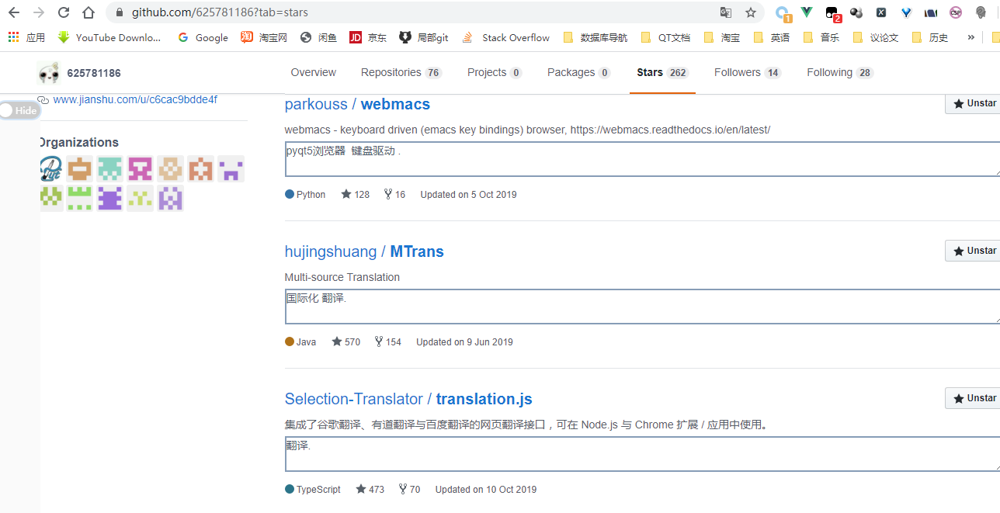
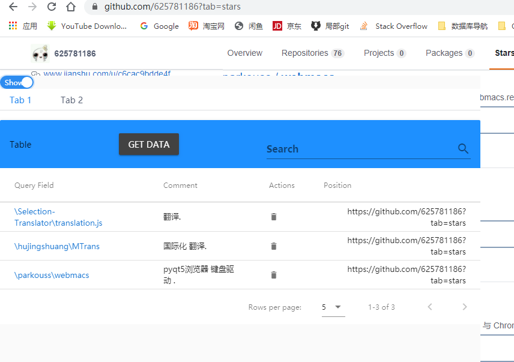
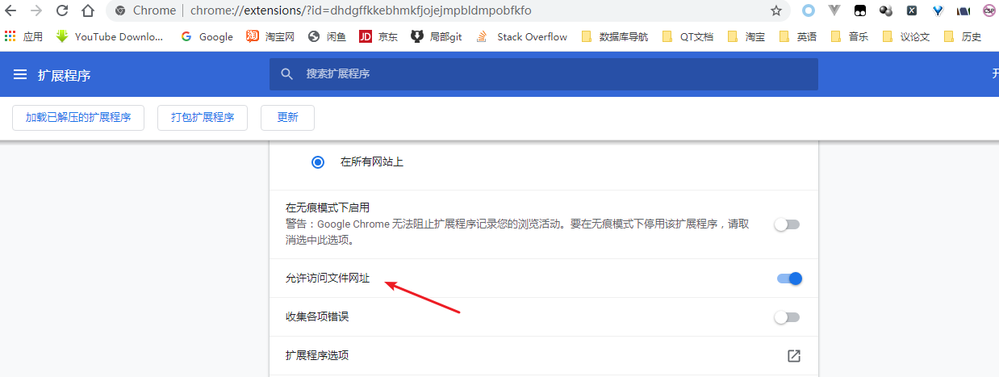
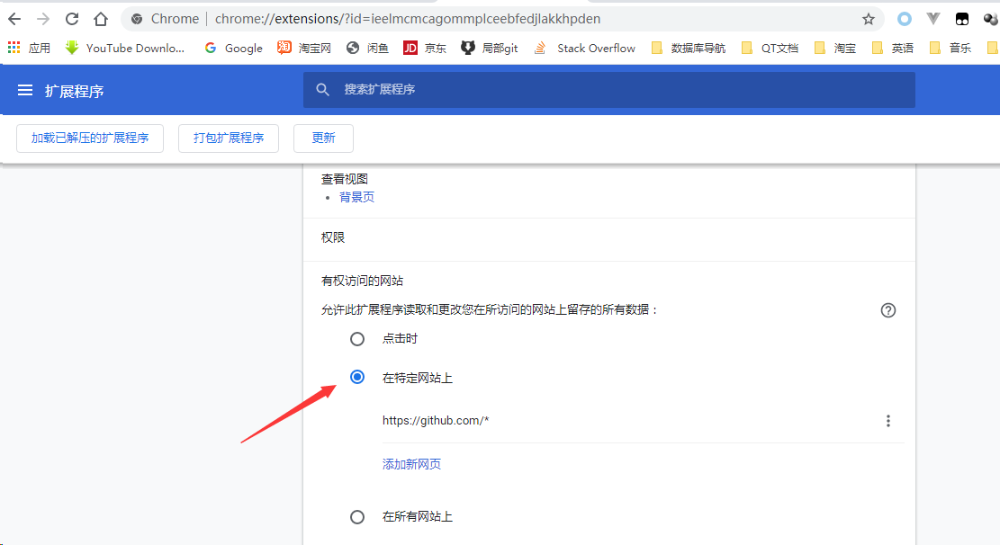

### gitpyman-web

github 备忘录 : 管理github的star过的项目.

#### 缺陷: 

<h3 style="color:red">需要翻墙!!!</h3>
1. 部分vuetify 样式 与github冲突 ; 
2. 需要用额外的插件来禁止chrome的CSP以达到可以使用firebase ;

#### TODO:

1. 自己写后台来绕过使用firebase (`RemoteDBFactory`) ; 

2. 尝试使用谷歌插件来绕过CSP ;

3. 通过传递appkey 而不是 写死在程序里 ; 

4. 桌面版更换脚本 ;

5. 增加watching页面 ;

6. 为更多的网站增加备注支持 ;

   ...

#### 插件界面:





#### 使用:
- 申请firebase 账号及应用 ; 
修改 [github_vue_db.js](github_vue_db.js)  `connect()`里的firebase key;
- 安装插件
1. [tampermonkey](https://chrome.google.com/webstore/detail/tampermonkey/dhdgffkkebhmkfjojejmpbldmpobfkfo) ; 
2. [disable-content-security](https://chrome.google.com/webstore/detail/disable-content-security/ieelmcmcagommplceebfedjlakkhpden) ;

- 在tampermonkey中新建一个脚本; 
```js
// ==UserScript==
// @name         github star vue
// @namespace    http://arunkhanchandani.com/
// @version      0.1
// @description  Store Browser history in Firebase!
// @author       Arun Khanchandani
// @include      https://github.com*
// @grant        none

// @require      https://www.gstatic.com/firebasejs/7.7.0/firebase-app.js
// @require      https://www.gstatic.com/firebasejs/7.7.0/firebase-firestore.js
// @require      https://www.gstatic.com/firebasejs/7.7.0/firebase-analytics.js

// @require      file:///D:\CodePro\Py\QML\__0_pro__\github_comment\gitpyman\油猴\dist\main.js


// @noframes
// ==/UserScript==


(function() {
    'use strict';

    window.add_dom();

})();
```
- 设置谷歌插件
1. 允许tampermonkey访问文件网址 ; 

2. 设置disable-content-security在特定网站(这个是chrome为了网站安全性, 但是我不确定设置特定网站是否会安全);
   

#### 贡献与开发:

[前置配置 使用](#使用)

- 基于nodejs 及 vue框架 ; UI 使用 vuetify 和 iview ;

```
clone

npm i --save

npm i webpack webpack-cli -g

npm run watch
```

- 目录:
```
├── components                                                             
    ├── App.vue                 :>>> 1.增加页面dom逻辑 ;                                           
    └── table.vue               :>>> 2.表格逻辑 ;                                           
├── dist                        :>>>                                           
    └── main.js                 :>>> 在tampermonkey里使用的打包脚本 ;                                           
├── lib                         :>>>                                           
    ├── jquery-1.9.0.min.js     :>>>                                           
    └── vuetify_style.js        :>>>                                           
├── github_vue_bus.js           :>>> 信号槽;                                           
├── github_vue_db.js            :>>> 与后台交互;                                    
├── github_vue_tab.js           :>>> 判断github的url使用不用的规则 来增加dom                                          
├── main.js                     :>>> 0.入口;                                          
├── package.json                :>>>                                           
└── webpack.config.js           :>>> webpack配置; 
```


